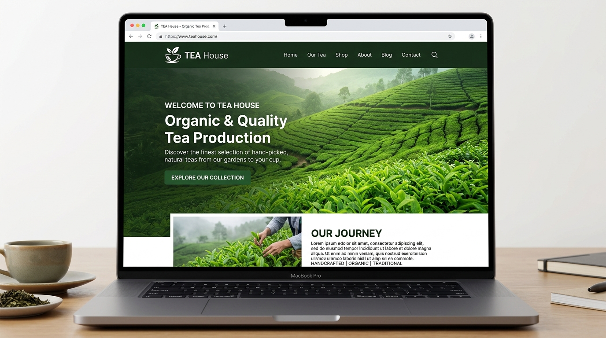
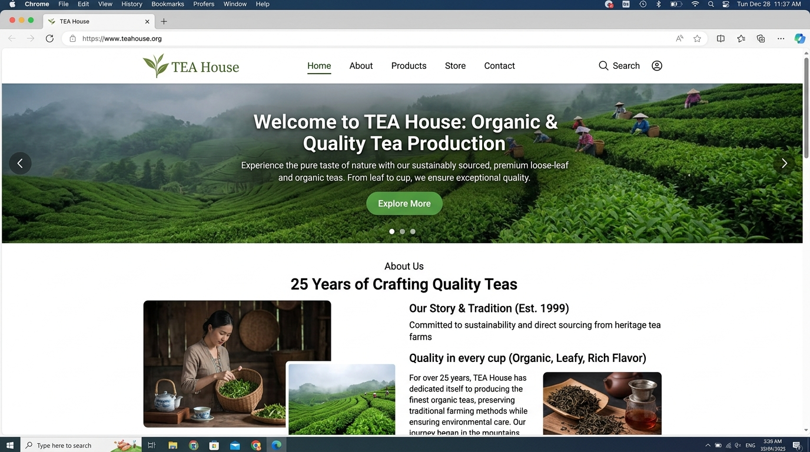
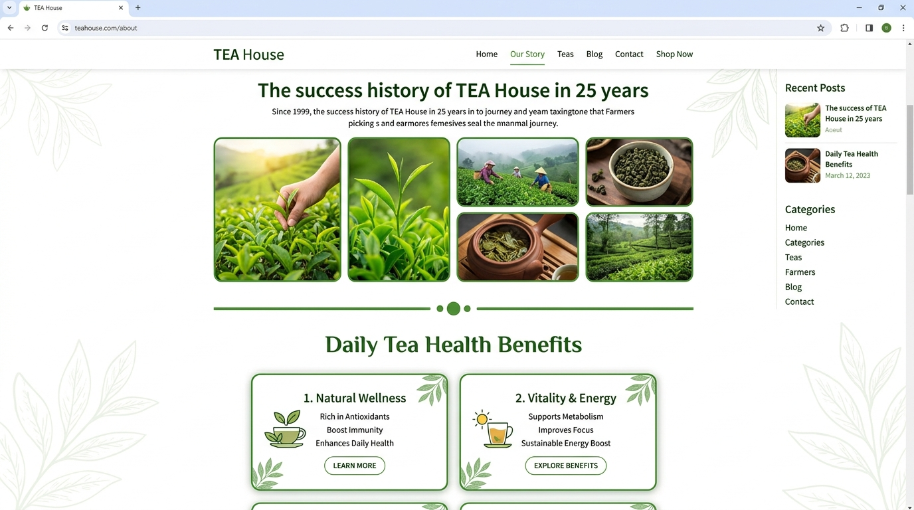
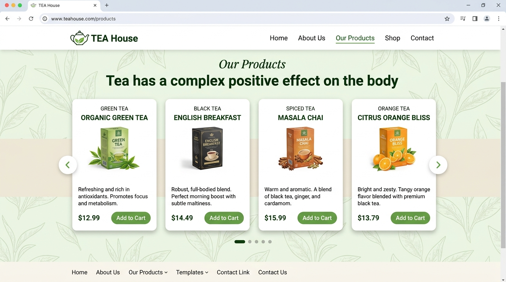
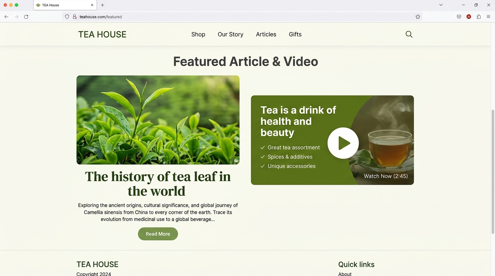
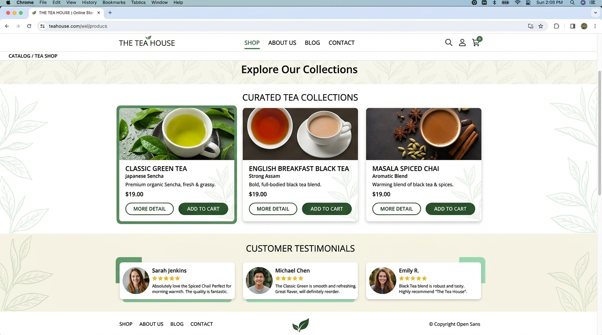
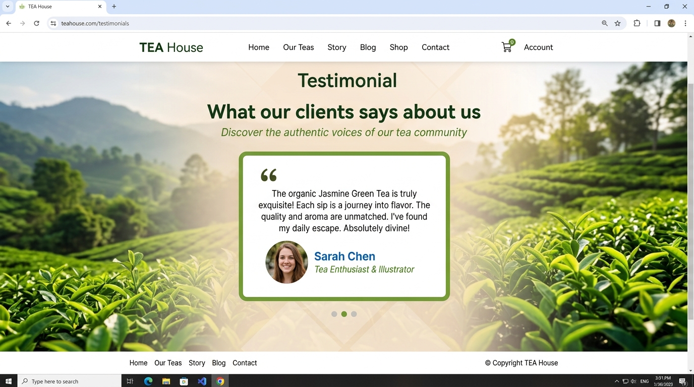
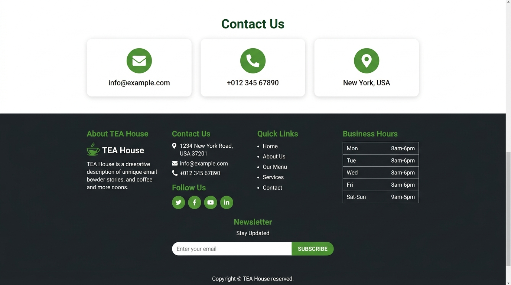

# TEA House — Organic & Quality Tea Production

A responsive web application for **TEA House**, showcasing premium organic tea collections, brand heritage, interactive product carousels, online store items, and customer testimonials.

---

## 🍵 Website Preview



---

## 📸 Screenshots Gallery

Explore the complete visual walkthrough of the TEA House web experience:

### 1. Homepage & Hero Carousel
*Full-width responsive slider introducing TEA House's organic tea production with brand storytelling and call-to-actions.*



---

### 2. About Us & Heritage
*25-year history of craftsmanship, featuring organic harvesting photo grids and health benefit highlights.*



---

### 3. Product Variety Carousel
*Interactive slider featuring Green Tea, Black Tea, Spiced Tea, and Orange Tea in custom cards.*



---

### 4. Featured Article & Health Benefits
*Editorial insight into the history of tea leaves, accompanied by the health & beauty feature banner with icon checklist.*



---

### 5. Online Store & Shopping Experience
*E-commerce showcase with item pricing ($19.00), hover overlays, "More Detail", and "Add to Cart" interactions.*



---

### 6. Client Testimonials
*Customer review carousel card with distinct green borders and avatar highlights.*



---

### 7. Contact Information & Footer
*Direct contact channels (email, phone, location), office hours, social links, and newsletter subscription form.*



---

## 🌟 Key Features

- **Hero Slider**: Full-width interactive carousel with animated call-to-actions.
- **Brand Story & Heritage**: Highlighting 25 years of tea crafting and organic cultivation.
- **Product Showcase**: Interactive carousel highlighting Green Tea, Black Tea, Spiced Tea, and Orange Tea.
- **Featured Article & Health Highlights**: Engaging insights into tea history, beauty, and health benefits.
- **Online Store**: Product catalog with quick-action hover effects ("More Detail" and "Add to Cart").
- **Client Testimonials**: Carousel slider presenting customer reviews and feedback.
- **Contact & Business Hours**: Dedicated contact info, operating hours, and email newsletter subscription.
- **Responsive Layout**: Designed for seamless browsing across desktops, tablets, and smartphones.

---

## 🛠️ Tech Stack

- **Frontend**: HTML5, CSS3, [Bootstrap 5](https://getbootstrap.com/), [Font Awesome 6](https://fontawesome.com/)
- **Server**: Node.js, [Express](https://expressjs.com/)
- **Typography & Icons**: Font Awesome icon library and modern clean typography

---

## 📁 Project Structure

```text
├── img/                             # Images, icons, and screenshot assets
│   ├── preview.jpg                  # Overall website preview mockup
│   ├── screenshot-home.jpg          # Homepage & Hero Carousel
│   ├── screenshot-about.jpg         # About Us & Brand Heritage
│   ├── screenshot-products.jpg      # Products Carousel
│   ├── screenshot-article.jpg       # Featured Article & Benefits
│   ├── screenshot-store.jpg         # Online Store Catalog
│   ├── screenshot-testimonials.jpg  # Customer Testimonials
│   ├── screenshot-footer.jpg        # Contact & Footer
│   ├── carousel-1.jpg               # Hero banner 1
│   ├── carousel-2.jpg               # Hero banner 2
│   ├── product-*.jpg                # Product images
│   ├── store-product-*.jpg          # Store catalog images
│   └── ...
├── index.html                       # Main website template
├── server.js                        # Express static web server
├── package.json                     # Project metadata & dependencies
└── README.md                        # Project documentation with full screenshot gallery
```

---

## 🚀 Getting Started

### Prerequisites

Ensure you have **Node.js** (v18 or higher) and **npm** installed.

### Installation & Running Locally

1. Clone or extract the repository:
   ```bash
   git clone https://github.com/AyushNinawe/Bootstrap-Project.git
   cd Bootstrap-Project
   ```

2. Install dependencies:
   ```bash
   npm install
   ```

3. Start the development server:
   ```bash
   npm run dev
   ```

4. Open your browser and navigate to:
   ```
   http://localhost:3000
   ```
